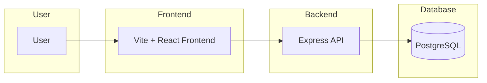

# Architecture

This document provides C4 Level 2 diagrams for the current and target architecture of the JobFit AI platform.

## Current Architecture (C4 Level 2)



## Target Architecture (C4 Level 2)

```mermaid
flowchart LR
  U[User] -->|HTTPS| ALB[Application Load Balancer]
  ALB --> FE[React Frontend (EKS)]
  ALB --> API[Backend API (EKS)]
  API --> DB[(RDS PostgreSQL)]
  API --> Redis[(ElastiCache Redis)]
  API --> S3[(S3 Bucket)]
  API --> AI[OpenAI API]
  Worker[Worker Pod (EKS)] --> Redis
  Worker --> S3
  Worker --> AI
```

### Notes

- The current monolithic Express API will be containerized and scaled in EKS behind an ALB with TLS.
- Persistent state (PostgreSQL, Redis, S3) will leverage managed AWS services.
- AI integrations will be abstracted through a provider-agnostic interface.
