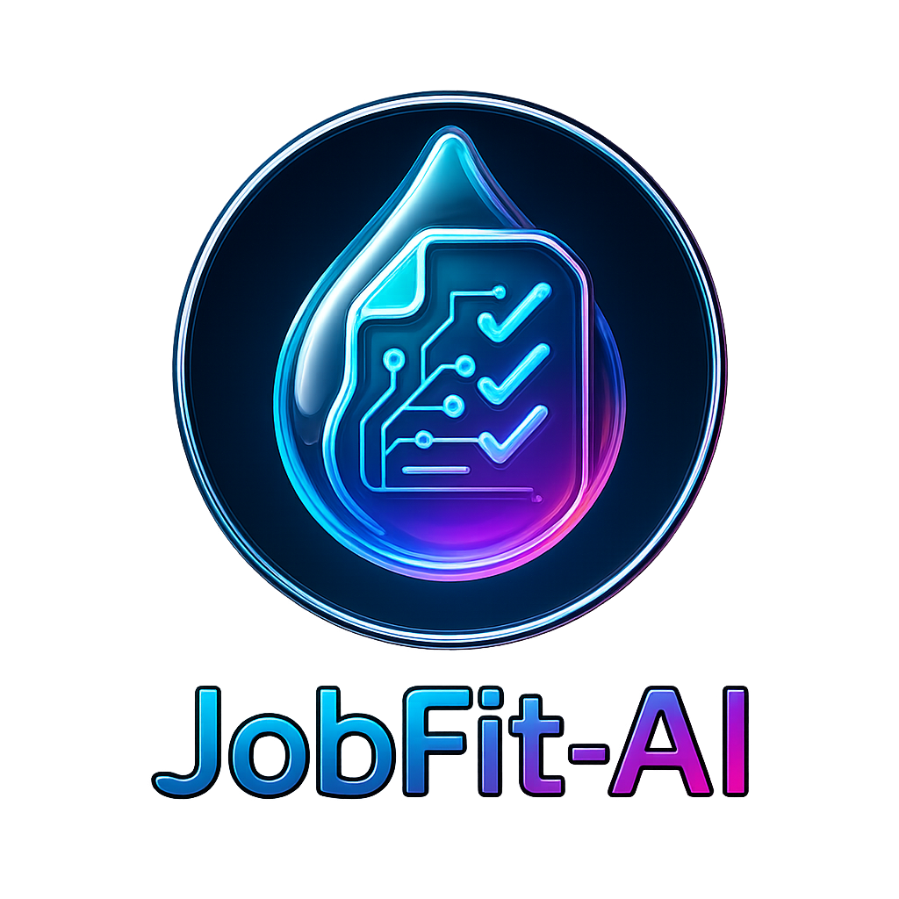

<!--
JobFit AI is a comprehensive web application designed to help job seekers optimize their resumes using AI-powered analysis, role recommendations, and tailored resume generation. The platform leverages advanced AI and real-time job market data to maximize job application success rates.
-->

  

# JobFit AI - Intelligent Resume Analysis and Optimization Platform

## Overview
JobFit AI is a comprehensive web application designed to help job seekers optimize their resumes using AI-powered analysis, role recommendations, and tailored resume generation. The platform leverages advanced AI and real-time job market data to maximize job application success rates. The platform provides resume parsing, ATS scoring, role recommendations, and tailored resume generation to improve job application success rates.

## System Architecture

### Frontend Architecture
- **Framework**: React with TypeScript for type safety
- **Styling**: Tailwind CSS with shadcn/ui component library for consistent design
- **Routing**: Wouter for lightweight client-side routing
- **State Management**: TanStack Query (React Query) for server state management
- **Build Tool**: Vite for fast development and optimized production builds

### Backend Architecture
- **Runtime**: Node.js with Express framework
- **Language**: TypeScript with ES modules
- **Database**: PostgreSQL with Drizzle ORM for type-safe database operations
- **Database Provider**: Neon Database (serverless PostgreSQL)
- **File Processing**: Multer for file upload handling
- **Session Management**: Built-in storage system with memory-based implementation

### Development Environment
- **Platform**: Node.js 20, web, and PostgreSQL 16 modules
- **Hot Reload**: Vite development server with HMR
- **Process Management**: TSX for TypeScript execution in development

## Key Components

### Resume Processing Pipeline
1. **File Upload**: Supports PDF, DOCX, TXT, MD, RTF, and ODT formats (10MB limit)
2. **Content Parsing**: Extracts structured data including contact info, experience, education, and skills
3. **ATS Scoring**: Analyzes resume compatibility with Applicant Tracking Systems
4. **Skill Profiling**: Categorizes and evaluates technical, soft, and domain-specific skills

### AI-Powered Features
- **Role Recommendations**: Matches user skills to relevant job positions using semantic analysis
- **Resume Tailoring**: Customizes resume content based on specific job descriptions
- **Improvement Suggestions**: Provides actionable feedback for resume optimization

### User Interface Components
- **Dashboard**: Central hub displaying stats, recent activity, and quick actions
- **File Upload**: Drag-and-drop interface with progress tracking
- **Resume Builder**: Step-by-step form for manual resume creation with validation
- **Resume Cards**: Interactive cards with optimization, tailoring, and export actions
- **Skill Profile**: Visual representation of user competencies
- **Role Recommendations**: Displays job matches with fit scores
- **Tailoring Workspace**: Interactive editor for customizing resumes
- **Export Modal**: Multi-format download system with optimized versions
- **Optimization Modal**: Visual score comparison and improvement tracking

## Data Flow

1. **Upload Phase**: User uploads resume → Server processes file → Content extracted and parsed
2. **Analysis Phase**: Parsed data → AI analysis → Skill profiling and ATS scoring
3. **Recommendation Phase**: User profile → Job matching algorithm → Role suggestions
4. **Tailoring Phase**: Original resume + Job description → AI optimization → Improved resume

## External Dependencies

### Core Libraries
- **Database**: Drizzle ORM with PostgreSQL adapter, Zod for schema validation
- **UI Framework**: Radix UI primitives with shadcn/ui components
- **Development**: Vite, TypeScript, ESBuild for production builds
- **File Processing**: Multer for multipart form handling

### Database Schema
- **Users**: Authentication and user management
- **Resumes**: Original files, parsed content, and processing status
- **Role Recommendations**: AI-generated job matches with scoring
- **Tailored Resumes**: Customized versions with improvement tracking
- **Activities**: User action logging and analytics

## Deployment Strategy

### Production Build
- **Frontend**: Vite builds static assets to `dist/public`
- **Backend**: ESBuild bundles server code to `dist/index.js`
- **Database**: Drizzle migrations applied via `db:push` command

### Environment Configuration
- **Development**: `npm run dev` starts both frontend and backend with hot reload
- **Production**: `npm run start` serves built application
- **Database**: PostgreSQL connection via `DATABASE_URL` environment variable

